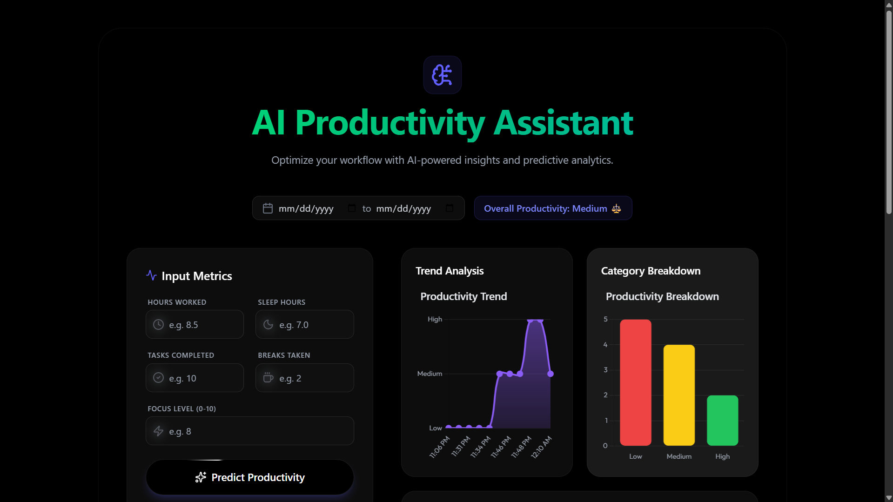

🧠 AI Productivity Assistant

An intelligent, data-driven dashboard built with FastAPI, Machine Learning, and OpenRouter AI 
to predict, analyze, and visualize daily productivity patterns.

---

🚀 Overview

The AI Productivity Assistant is your personal productivity coach — combining ML predictions, AI-generated insights, and rich data visualization.

It helps you:
- Predict your daily productivity level (Low, Medium, High)
- Receive personalized AI recommendations
- Visualize productivity trends and breakdowns
- Generate weekly AI summaries from your performance data

---



⚙️ Features

| Feature | Description |
|----------|-------------|
| 🤖 Machine Learning Model | Random Forest classifier trained on synthetic data to predict productivity |
| 🧠 AI Insight Generator | Uses [OpenRouter API](https://openrouter.ai) for free text-based recommendations |
| 📈 Productivity Trend Chart | Dynamic line chart tracking your daily productivity levels |
| 📊 Category Breakdown Chart | Bar chart showing distribution of Low/Medium/High days |
| 💾 Persistent Data | SQLite database stores each prediction for long-term analysis |
| 🗓️ Weekly Summary | AI-generated natural-language summary of the past 7 days |
| 🎨 Modern UI | TailwindCSS + Chart.js front-end with animations and spinner loading |
| ⚡ FastAPI Backend | Clean API design, easily deployable to Render or Hugging Face Spaces |

---

🧰 Tech Stack

Backend: FastAPI, Scikit-learn, Pandas, SQLAlchemy  
Frontend: TailwindCSS, Chart.js, Jinja2 Templates  
AI Layer: OpenRouter API (free tier)  
Database: SQLite  
Language: Python 3.10+

---

 🧩 Project Structure

```

ai-productivity-assistant/
│
├── main.py                   # FastAPI app with endpoints
├── data_generator.py          # Synthetic data generator
├── train_model.py             # ML model training script
├── database.py                # SQLite ORM (SQLAlchemy)
│
├── model/
│   └── model.pkl              # Trained RandomForest model
│
├── templates/
│   └── dashboard.html         # Interactive web dashboard
│
├── utils/
│   └── ai_insights.py         # OpenRouter AI integration
│
├── requirements.txt           # Dependencies
└── README.md                  # Documentation

````

---

 🧠 How It Works

1. Data Generation: Synthetic productivity data is created and used to train a model.  
2. Model Prediction: FastAPI takes your inputs and predicts productivity category.  
3. AI Insight: The app calls OpenRouter’s Mistral model for personalized recommendations.  
4. Visualization: Results are plotted dynamically in trend and bar charts.  
5. Storage: Each record is saved in SQLite for weekly summaries and analysis.

---

⚙️ Installation

```bash
# 1️⃣ Clone this repository
git clone https://github.com/adiiirajjj/ai-productivity-assistant.git
cd ai-productivity-assistant

# 2️⃣ Create and activate a virtual environment
python -m venv venv
source venv/bin/activate  # On Windows: venv\Scripts\activate

# 3️⃣ Install dependencies
pip install -r requirements.txt

# 4️⃣ Generate synthetic data and train model
python data_generator.py
python train_model.py
````

---

🔑 Environment Setup

Create a `.env` file in the root directory:

```
OPENROUTER_KEY=sk-or-v1-xxxxxxxxxxxxxxxxxxxxxxxxxxxx
```

> Get your free API key from [https://openrouter.ai/settings/keys](https://openrouter.ai/settings/keys)

---

 ▶️ Running the App

```bash
uvicorn main:app --reload
```

Then open your browser:
👉 [http://127.0.0.1:8000](http://127.0.0.1:8000)

---

📊 Dashboard Preview

Input Form: Enter daily metrics (hours, sleep, focus, etc.)
Prediction Result: Displays category + AI-generated advice
Trend Chart: Live line chart of your productivity over time
Breakdown Chart: Bar visualization of category distribution
Weekly Summary: One-click AI summary of your performance

---

 🧩 API Endpoints

| Endpoint          | Method | Description                               |
| ----------------- | ------ | ----------------------------------------- |
| `/`               | GET    | Loads dashboard                           |
| `/predict`        | POST   | Returns prediction + AI insight           |
| `/weekly_summary` | GET    | Generates AI-based summary of weekly data |

---

 🧠 Example Output

```
Predicted Productivity: Medium
Recommendation: You’re doing okay, but try improving focus or sleep hours.
AI Insight: Prioritize deep work sessions early in the day for better momentum.
```

---

 🧭 Future Enhancements

* 🌐 Cloud deployment (Render, Hugging Face Spaces)
* 🔄 Auto-update via cron jobs
* 📅 Monthly report generator
* 🧩 User authentication and multi-user tracking
* 🤝 Integration with Google Calendar / Notion

---

💡 Author

Aditya Raj
📍 AI/ML Enthusiast | Automation Developer | Lifelong Learner
🔗 [GitHub](https://github.com/adiiirajjj)

---

🪄 License

This project is licensed under the MIT License — free to use and modify with attribution.

---

⚡ “Build once. Automate forever.”

Your personal AI productivity companion — powered by data, driven by learning.
